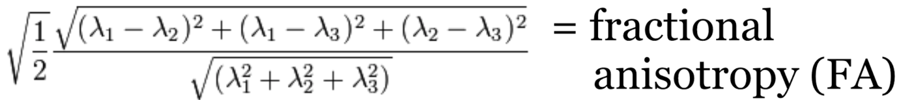
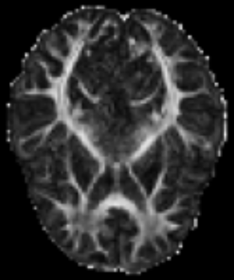

# PyAFQ Tractometry Pipeline

pyAFQ is an open-source software tool for the analysis of brain white matter in diffusion MRI measurements. It implements a complete and automated data processing pipeline for tractometry, from raw DWI data to white matter tract identification, as well as quantification of tissue properties along the length of the major long-range brain white matter connections. The pipeline can be broken down into 4 steps we will go over:

1. Model fitting to the DWI data
2. Tractography
3. Bundle Recognition
4. Tract profilign

# Model Fitting
Diffusion data is typically on the order of 1.5-2mm cubic voxels. The underlying axons are micrometers in size. So what are we actually measuring? The patterns of large groups of axons!

Takemura et al. (2024)

When you collect diffusion data, you are perturburing water molecules and observing how they respond. Within the gray matter and corticospinal fluid (CSF), they typically respond roughly isotroptically. But in large groups of axons, the myelin sheath costrains water diffusion and produces an anisotropic signal! Here we visualize this as a tensor, which is how diffusion tensor imaging (DTI) models the data.

  
  

  

One common metric of DTI is fractional anisotropy (FA), a measure of anisotropy. FA corresponds to multiple underlying biological phenomenon, such as myelination, axon coherence, density of axons.

  

     
    
  

  

    
  

Notice: There are many models for modelling diffusion data, and many acronyms! Here we introduced diffusion tensor imaging (DTI), and one metric from DTI: fractional anistropy (FA). But pyAFQ uses many more models and metrics than just this!

Thanks: Rafael Neto-Henriques

## Tractography
Visualize streamlines generated from diffusion MRI data, generated through probabilistic tracking algorithms. This initial tractography output is generated with a monte carlo approach, and is attempting to represent the set of potential white matter pathways. This means many of these streamlines are not biologically plausible.

  
  

Jeurissen et al., 2017, also: Behrens, 2013, Descoteaux, 2014, Dell’Acqua, 2014, Tournier, 2014

Notice: probabilistic tracking is used due to the inherit ambiguity of the data

Maier-Hein et al., 2014

## ROIs and Recognized Bundles
There are many ways of filtering away streamlines that are not biologically possible. We use anatomical waypoint regions (ROIs) to select specific fiber bundles from the full tractography. The ROIs are shown for the arcuate in blue (left), and then the recognized arcuate after filtering in cleaning is shown (right).

  
  

## Tract Profiling
We can also visualize the values of tissue properties along the bundle. Here we will visualize the fractional anisotropy (FA) along the arcuate bundle (left) and corticospinal tract (right). 

  
  

Finally, we can visualize the core of the bundle and the tract profile. The core of the bundle is the median of the streamlines, and the tract profile is the values of the tissue property along the core of the bundle.

  
  

## Output of pyAFQ
We can visualize the tract profiles as a table and store them in a CSV. You can plot the tract profiles for each bundle as a line plot, with the x-axis representing the position along the bundle, and the y-axis representing the value of the tissue property (top). You can also export in a CSV to import to any statistics/machine learning model of your choice (bottom).

# Review

# Running pyAFQ in practice
[https://tractometry.org/pyAFQ/tutorials/tutorial_examples/plot_002_participant_afq_api.html](https://tractometry.org/pyAFQ/tutorials/tutorial_examples/plot_002_participant_afq_api.html)

# AFQ Insight Example
[AFQ-Insight, analysis after pyAFQ](https://tractometry.org/AFQ-Insight/auto_examples/plot_als_classification.html)

# Resources Overview

Kruper et al., 2025

Ecosystem Examples:
[preprint.neurolibre.org/10.55458/neurolibre.00037/](https://preprint.neurolibre.org/10.55458/neurolibre.00037/)

| Name           | Description                                                                                                                                                                                                                                                                                                                                 | URL                                  |
|----------------|---------------------------------------------------------------------------------------------------------------------------------------------------------------------------------------------------------------------------------------------------------------------------------------------------------------------------------------------|--------------------------------------|
| **QSIPrep**    | Configures pipelines for pre-processing dMRI data, such as: distortion correction, motion correction, denoising, etc.                                                                                                                                                                                                                       | [qsiprep.readthedocs.io/](qsiprep.readthedocs.io/) |
| **pyAFQ**      | Automated Fiber Quantification (AFQ) in Python: performs tractometry on the preprocessed data, and generates tractograms for known tracts and their tissue properties in a CSV for visualization and statistics. By default, it also uses the interactive graphing library Plotly to generate HTMLs. Plotly is pip-installable and works in a headless environment, which makes it convenient on servers. | [tractometry.org/pyAFQ/](tractometry.org/pyAFQ/) |
| **AFQ-Browser** | A web-based visualization tool for exploring tractometry results from pyAFQ. pyAFQ will generate all necessary inputs to AFQ-Browser in the right format using the `assemble_AFQ_browser` method.                                                                                                                                          | [tractometry.org/AFQ-Browser/](tractometry.org/AFQ-Browser/) |
| **FURY**       | A Python library for advanced 3D visualization, with specific methods for neuroimaging and tractography. This can be useful for visualizing the tractography files generated by pyAFQ.                                                                                                                                                      | [fury.gl/](fury.gl/) |
| **Tractoscope** | A tool for interactive visualization and analysis of tractography data designed to work specifically with qsiprep/pyAFQ-produced datasets. It uses the niivue library.                                                                                                                                                                     | [nrdg.github.io/tractoscope/](nrdg.github.io/tractoscope/) |
| **Tractable**  | An R library for fitting Generalized Additive Models (GAMs) on the tractometry data output by pyAFQ in CSVs.                                                                                                                                                                                                                               | [tractometry.org/tractable/](tractometry.org/tractable/) |
| **AFQ Insight** | A library for statistical analysis of tractometry data in python, including both machine learning and statistical workflows. It uses the CSVs of tissue properties outputted by pyAFQ.                                                                                                                                                     | [tractometry.org/AFQ-Insight](tractometry.org/AFQ-Insight) |
